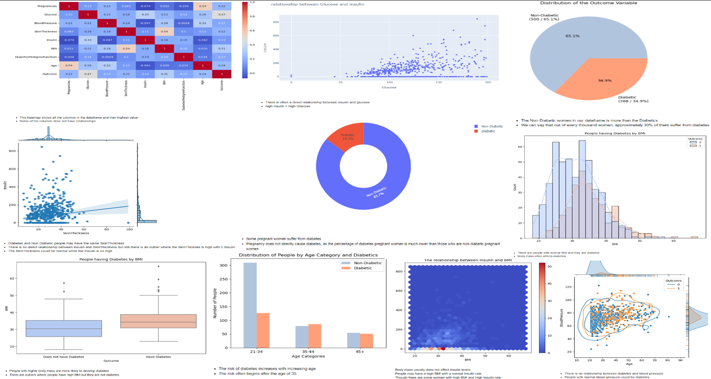

## Introduction
Diabetes is a chronic health condition that affects how your body turns food into energy. There are two main types of diabetes: type 1 and type 2. Type 1 diabetes is an autoimmune disease that occurs when your body attacks the cells in your pancreas that produce insulin.

## Summary
This dataset is originally from the National Institute of Diabetes and Digestive and Kidney Diseases. The objective of the dataset is to diagnostically predict whether a patient has diabetes, based on certain diagnostic measurements included in the dataset. Several constraints were placed on the selection of these instances from a larger database. In particular, all patients here are females at least 21 years old of Pima Indian heritage.

In order to adequately analyze these data to answer the key questions and make recommendations, We will follow the key steps of Data Analysis Process: Ask, Prepare, Process, Analyze, Share, and Act.

### I. ASK
a. **Asks**
- Analyze data to gain insights into how females are getting diagnosed with diabetes.

b. **Questions**
1. Who are the women that gain diabetes?
2. How could these women prevent themselves from getting diabetes?
3. Diabetes is correlated with what?

### II. PREPARE
We will be using Python and some of its popular data science-related packages. First of all, we will import pandas to read our data from a CSV file and manipulate it for further use. We will also use numpy to convert our data into a more suitable format, and data profiling for the last report. We will use seaborn, matplotlib, and plotly for visualizations.

a. **Data Source**
- This dataset is originally from the National Institute of Diabetes and Digestive and Kidney Diseases/Kaggle.

b. **Data Assessment for Credibility & Integrity**
We will utilize the ROCCC (Reliable, Original, Comprehensive, Current & Cited) data test model to determine the credibility and reliability of the dataset.
1. Reliable — HIGH — no sample bias, the sample size is high.
2. Original — HIGH — National Institute of Diabetes and Digestive and Kidney Diseases
3. Comprehensive — HIGH — Data is within the parameters are clear and good.
4. Current — MEDIUM — data was sourced and put online in 2022.
5. Cited — HIGH — the data can be found on Kaggle.
Overall, the dataset is considered high-quality data and it is recommended to produce insights and answers based on this data.

c. **Data Selection**
- `diabetes.csv`

### III. PROCESS
Here, we will perform data cleaning operations to ensure the dataset is correct, complete, and error-free:
- Explore and observe data
- Check for missing or null values
- Transform data — format data type
- Conduct statistical analysis

**Columns:**
- **Pregnancies:** Number of pregnancies
- **Glucose:** 2-hour plasma glucose concentration in oral glucose tolerance test
- **Blood Pressure:** Blood Pressure (small blood pressure) (mm Hg)
- **Skin Thickness:** Skin Thickness
- **Insulin:** 2-hour serum insulin (mu U/ml)
- **DiabetesPedigreeFunction:** Function (2-hour plasma glucose concentration in oral glucose tolerance test)
- **BMI:** Body mass index
- **Age:** Age (years)
- **Outcome:** Have the disease (1) or not (0)

### V. SHARE

**Findings**
1. All variables except insulin seem to have some degree of normal distribution.
2. All variables have outliers.
3. There are no missing values.

### ACT
In this final phase, we will answer the key question and provide recommendations based on our analysis to prevent the spread of diabetes among women.

**Recommendation:**
- Women who tend to have a high level of BMI, insulin, and glucose are more likely to get diabetes.
- To prevent and secure females, they need to ensure that a healthy lifestyle is accomplished by:
  1. Maintaining a healthy weight
  2. Eating a healthy diet
  3. Getting a regular exercise routine
- There is no one thing that is correlated with diabetes; only the more unhealthy variables there are, the higher the risk accumulation of getting diabetes.
